<!---
hidden text
**Table of Contents**  *generated with [DocToc](http://doctoc.herokuapp.com/)*
-->
# Automated Installation of Cloudera Manager, CDH and Managed Services by Cloudera Manager

**Table of Contents**

- [Objective](#objective)
- [Sign up for AWS Console](#sign-up-for-aws-console)
- [Create a key-value pair for authentication](#create-a-key-value-pair-for-authentication)
- [Create EC2 instances](#create-ec2-instances)
	- [Choose AMI](#choose-ami)
	- [Choose Instance Type](#choose-instance-type)
	- [Configure Instance](#configure-instance)
	- [Add Storage](#add-storage)
	- [Tag Instance](#tag-instance)
	- [Configure Security Group](#configure-security-group)
	- [Review and launch](#review-and-launch)
	- [Manage your instance](#manage-your-instance)
- [Server configuration](#server-configuration)
	- [Network](#network)
		- [Hostnames](#hostname)
		- [DNS](#dns)
		- [IPv6](#ipv6)
	- [Operating System](#operating-system)
		- [OS Version](#os-version)
		- [Swappiness](#swappiness)
		- [Firewalls](#firewalls)
		- [Kernel Security Modules](#kernel-security-modules)
		- [Add Groups and Users](#add-groups-and-users)
		- [Enable Password Authentication](#enable-password-authentication)
		- [Secure Shell](#secure-shells)
	- [Java](#java)
	- [Databases](#databases)
		- [Installing and Configuring a MySQL Database](#installing-and-configure-a-mysql-database)
	- [Repository Access](#repository-access)
- [Cloudera Manager and CDH installation and configuration](#cloudera-manager-and-cdh-installation-and-configuration)
	- [Download and run the Cloudera Manager installer](#
download-and-run-the-cloudera-manager-installer)
	- [Start the Cloudera Manager Admin Console](#start-the-cloudera-manager-admin-console)
	- [Specify the Cloudera Manager edition](#specify-the-cloudera-manager-edition)
	- [Specify hosts for CDH cluster installation](#specify-hosts-for-cdh-cluster-installation)
	- [Cluster Installation - Select Repository](#cluster-installation---select-repository)
	- [Cluster Installation - JDK Installation Optioins](#cluster-installation---jdk-installation-optioins)
	- [Cluster Installation - Provide SSH Login Credentials](#cluster-installation---provide-ssh-login-credentials)
	- [Cluster Installation - Install all the Cloudera Manager components to all the hosts in the cluster](#cluster-installation---install-all-the-cloudera-manager-components-to-all-the-hosts-in-the-cluster)
	- [Cluster Setup - Choose the CDH 5 Services for Installation](#cluster-setup---choose-the-cdh-5-services-for-installation)
	- [Cluster Setup - Customise Role Assignments](#cluster-setup---customise-role-assignments)
	- [Cluster Setup - Database Setup](#cluster-setup---database-setup)
	- [Cluster Setup - Review Configuration](#cluster-setup---review-configuration)
	- [Cluster Setup - Configure and Start all the services on the cluster](#cluster-setup---configure-and-start-all-the-services-on-the-cluster)

---

## Objective
The objective of this script is to configure a Cloudera Distribution Hadoop (CDH) cluster using Amazon Web Services (AWS) Elastic Compute (EC2).
For this install, you will need at least four EC2 instances (hosts). One host will run the Cloudera Manager services. The rest will run the Hadoop services.

## Sign up for AWS Console
The first step is to sign up for an AWS account to launch EC2 instances.

* Go to http://aws.amazon.com/account/
* Enter name, email, click on "sign in"
* Enter full name, email, billing info, credit bard, phone number authorization; select AWS support plan, use Basic (Free); see message "Thank you for updating your Amazon Web Services Account!”.
* Log in your account using the credential
* Choose "Launch the AWS Management Console"
* Click on button "sign in to the AWS console"
* Choose "I am a returning user and my password is"
* Click "sign in using our secure server";
* See "EC2 Dashboard" on the top left corner.

## Create a key-value pair for authentication
In AWS, you authorize yourself and communicate with EC2 instances using public and private key pair.

* On the left panel of EC2 dashboard, click on "network & security" category's "Key Pairs";
* Click on button "create key pair";
* Type your key pair name, for me, I put "CDH";
* You will be prompted with a download file window, choose a secure folder to save your .pem file which will be your private key.

## Create EC2 instances
Each EC2 instance is like a separate machine(or host).
Before we launch an instance we need to read the Cloudera pre-req docs to identify the correct OS version for the instances.
This can be found in one of the following links:
* http://www.cloudera.com/content/cloudera/en/documentation/core/latest/topics/cm_ig_cm_requirements.html
* http://archive-primary.cloudera.com/cdh5/repo-as-tarball/5.4.0/

For my setup, I will be using RHEL 6.5 and Cloudera 5.3.

On your left panel of EC2 dashboard,, click on "instances" category's "instances";
Click on button "launch instance";

### Choose AMI
Choose the correct OS option;click on "select";

### Choose Instance Type
* Instance type = m3.large;

### Configure Instance
* Number of instances = 4
* Network and Subnet = VPC
* Shutdown behaviour = Stop
* Tenancy = Shared Tenancy

> To Do: During next iteration include further details on IP addressing and network design, including management interfaces.

### Add Storage
Select 30GB (SSD) for /root without any encryption.

> To Do: During next iteration include further details on partitioning schemes for Master Nodes and Data Nodes.
> e.g., /data, /dfs, /journals, /zookeeper


### Tag Instance
"cloudera1","cloudera2","cloudera3" and "cloudera4"

### Configure Security Group

Each group is like a firewall. The nodes of the same cluster need to be in the same security group.

* Click on "create security groups",

* put name such as "launch-wizard-1" or change to your customized name;

* under "inbound" tab, cick on add rules and add the following five rules:

    * choose type="SSH", "save";
    * choose type="ALL ICM", Source=Anywhere, "save";
    * choose type="Custom TCP", port range="9000", choose "anywhere",save;
    * choose type="Custom TCP", port range="9001", choose "anywhere",save;
    * choose type="Custom TCP", port range="50000 - 50100", choose "anywhere", save;


* double check all your inbound setting, they should look like:

| Type            | Protocol  | Port Range      | Source            |
| ----------------|:---------:| ---------------:|------------------:|
| SSH             | TCP       | 22              |Anywhere 0.0.0.0/0 |
| Custom TCP Rule | TCP       | 9001            |Anywhere 0.0.0.0/0 |
| Custom TCP Rule | TCP       | 9000            |Anywhere 0.0.0.0/0 |
| Custom TCP Rule | TCP       | 50000 - 50100   |Anywhere 0.0.0.0/0 |
| All ICMP        | ICMP      | 0 - 65535(or na)|Anywhere 0.0.0.0/0 |

* check all your outbound setting, they should look like:

| Type            | Protocol  | Port Range      | Destination       |
| ----------------|:---------:| ---------------:|------------------:|
| All traffic     | All       | Al              |Anywhere 0.0.0.0/0 |


### Review and launch

* Click on "review and launch";
* Click on "launch";
* choose the key pair "CDH";
* check the acknowleage box;
* click on "launch instance",you should see "Your instances are now launching";
* scroll down to the bottom, click on "view instances",click one each instance and rename them, such as
* wait till you see the status checks is changed from "initializing" to "2/2 checks passed".


### Manage your instance

know how to turn on and off the instances
* select the instance, right click to choose "stop", you won't be able to use this instance and won't be charged;
* select the instance, right click to choose "start", you can use the instance and will be charged. --next time, if you restart the instance, your "public DNS" will be different, but your "private DNS" will not changed. If you reboot the instance, your "public DNS" will be the same as before rebooting.


## Server configuration

### Network

#### Hostnames

Ensure that hostname is set to the fully qualified domain name (FQDN).

``` ruby
grep HOSTNAME /etc/sysconfig/network
# if it is not the fully qualified domain name, do the following
perl -p -i -e "s/localhost.localadmin/${hostname}/g" /etc/sysconfig/network
```

#### DNS

Ensure that both forward and reverse lookup are functional.

For that, make your own reference table for public DNS

``` ruby
| machine name| public DNS                                       |
| ------------|:------------------------------------------------:|
| cdh1        |ec2-52-17-66-115.eu-west-1.compute.amazonaws.com  |
| cdh2        |ec2-52-16-198-107.eu-west-1.compute.amazonaws.com |
| cdh3        |ec2-52-17-43-87.eu-west-1.compute.amazonaws.com   |
```

Use the following commands:

``` ruby
$ host `hostname`
bp101.cloudera.com has address 10.20.195.121
$ host 10.20.195.121
121.195.20.10.in-addr.arpa domain name pointer bp101.cloudera.com
```

#### IPv6

Ensure that IPv6 is disabled.

Add the following lines at the end of the `/etc/sysctl.conf` file.


``` ruby
# disable ipv6
net.ipv6.conf.all.disable_ipv6 = 1
net.ipv6.conf.default.disable_ipv6 = 1
net.ipv6.conf.io.disable_ipv6 = 1

```

Add the following to `/etc/sysconfig/network` file.

``` ruby
NETWORKING_IPV6=no
IPV6INIT=no
```

### Operating System

#### OS Version
Ensure that a supported OS is in use.

``` ruby
cat /etc/redhat-release
```

#### Swappiness

For kernel version earlier than 2.6.32-303 [`uname -r`], set `vm.swappiness=0`. Otherwise, set it to 1.

``` ruby
sudo su root
echo "vm.swappiness = 1" >> /etc/sysctl.conf
echo 1 > /proc/sys/vm/swappiness
```

#### Firewalls

Disable all firewall software on and between the cluster hosts

``` ruby
service iptables stop
service ip6tables stop
/sbin/chkconfig --list iptables
/sbin/chkconfig --list ip6tables
/sbin/chkconfig iptables off
/sbin/chkconfig ip6tables off

# retsrt network services
/etc/init.d/network restart
```

#### Kernel Security Modules

Disable SELinux

Edit `/etc/sysconfig/selinux` to set `SELINUX=disabled`

``` ruby
selinuxenabled || echo "disabled"
sudo vi /etc/sysconfig/selinux
# set SELINUX=disabled
```
alternatively,
``` ruby
perl -p -i -e "s/^SELINUX=enforcing/SELINUX=disabled/g" /etc/selinux/config
```

> Note: a system reboot is required in order for the SELinux changes to take effect.

``` ruby
# restart the network services and reboot the server
/etc/init.d/network restart
init 6
```

#### Add Groups and Users
``` ruby
groupadd hadoop
useradd hduser -g hadoop
usermod -aG wheel hduser
perl -p -i -e "s/\# \%wheel/\%wheel/g" /etc/sudoers
passwd hduser
#hadoop20
```

#### Enable Password Authentication

``` ruby
perl -p -i -e "s/^PasswordAuthentication no/PasswordAuthentication yes/g" /etc/ssh/sshd_config
```

#### Secure Shell

Ensure that the secure shell daemon (sshd) is running:

``` ruby
service sshd status
service sshd start
```

Modify the ssh configuration file `/etc/ssh/ssh_config`, Uncomment the following line and change the value to no; this will prevent the question when connecting with SSH to the host.

``` ruby
StrictHostKeyChecking no
```

Enable passwordless SSH connectivity between the hosts:

``` ruby
# login as hduser
sudo su hduser
# generate your server key
ssh-keygen
#press "Enter" three times
cat /home/hduser/.ssh/id_rsa.pub
#copy and paste it into a text file for future
```

Configure "authorized_keys" file in all of the instances

``` ruby
# on Cloudera1 instance
cd /home/hduser/.ssh
vi authorized_keys
#go to the end of file by "ESC->o"
#copy/paste all the public rsa keys to the end of file
#save and exit file by "ESC->wq!"
#do the same on all the other instances
```
Test ssh connectivity
``` ruby
ssh hduser@ec2-52-17-249-61.eu-west-1.compute.amazonaws.com
ssh hduser@ec2-52-17-211-71.eu-west-1.compute.amazonaws.com
ssh hduser@ec2-52-17-214-162.eu-west-1.compute.amazonaws.com
ssh hduser@ec2-52-17-234-3.eu-west-1.compute.amazonaws.com
```
### Java

``` ruby
java -version
javac -version
update-java-alternatives --list
alternatives --display java
```

### Databases

Cloudera Manager uses databases to store information about the Cloudera Manager configuration, as well as information such as the health of the system or task progress. Cloudera Manager supports using a variety of databases to store required information. To facilitate rapid completion of simple installations, the Cloudera Manager can install and configure a PostgreSQL database as part of the broader Cloudera Manager installation process. This automatically installed database is sometimes referred to as an embedded PostgreSQL database. While the embedded database is a useful option for getting started quickly, Cloudera Manager also allows you to use other databases. You can opt to use your own PostgreSQL database or MySQL or Oracle databases.

#### Installing and Configuring a MySQL Database
``` ruby
# install mysql server
sudo yum install mysql-server

# start mysql daemon
sudo service mysqld start

# configure mysqld to startup automatically following reboot
chkconfig mysqld on
chkconfig --list mysqld
> mysqld          0:off   1:off   2:on    3:on    4:on    5:on    6:off

# install mysql JDBC connector
sudo yum install mysql-connector-java

# secure mysql install
sudo /usr/bin/mysql_secure_installation
> [...]
> Enter current password for root (enter for none):
> OK, successfully used password, moving on...
> [...]
> Set root password? [Y/n] y
> New password:
> Re-enter new password:
> Remove anonymous users? [Y/n] Y
> [...]
> Disallow root login remotely? [Y/n] N
> [...]
> Remove test database and access to it [Y/n] Y
> [...]
> Reload privilege tables now? [Y/n] Y
> All done!

# Log into MySQL as the root user
mysql -u root -p
> Enter password: (use password 'hadoop20')

# create databases to support cloudera manager and hadoop ecosystem components

# create a database for the Activity Monitor. 
create database amon DEFAULT CHARACTER SET utf8;
> Query OK, 1 row affected (0.00 sec)
grant all on amon.* TO 'amon'@'%' IDENTIFIED BY 'hadoop20';
> Query OK, 1 row affected (0.00 sec)

# create a database for the Service Monitor
create database smon DEFAULT CHARACTER SET utf8;
> Query OK, 1 row affected (0.00 sec)
grant all on smon.* TO 'smon'@'%' IDENTIFIED BY 'hadoop20';
> Query OK, 1 row affected (0.00 sec)

# create a database for the Report Monitor
create database rman DEFAULT CHARACTER SET utf8;
> Query OK, 1 row affected (0.00 sec)
grant all on rman.* TO 'rman'@'%' IDENTIFIED BY 'hadoop20';
> Query OK, 1 row affected (0.00 sec)

# create a database for the Host Monitor
create database hmon DEFAULT CHARACTER SET utf8;
> Query OK, 1 row affected (0.00 sec)
grant all on hmon.* TO 'hmon'@'%' IDENTIFIED BY 'hadoop20';
> Query OK, 0 rows affected (0.00 sec)


# create a database for the Hive metastore
create database metastore DEFAULT CHARACTER SET utf8;
> Query OK, 1 row affected (0.00 sec)
grant all on metastore.* TO 'metastore'@'%' IDENTIFIED BY 'hadoop20';
> Query OK, 1 row affected (0.00 sec)

# create a database for Cloudera Navigator
create database nav DEFAULT CHARACTER SET utf8;
> Query OK, 1 row affected (0.00 sec)
grant all on nav.* TO 'nav'@'%' IDENTIFIED BY 'hadoop20';
> Query OK, 1 row affected (0.00 sec)

# create a database for Sentry
create database sentry DEFAULT CHARACTER SET utf8;
> Query OK, 1 row affected (0.00 sec)
grant all on sentry.* TO 'sentry'@'%' IDENTIFIED BY 'hadoop20';
> Query OK, 1 row affected (0.00 sec)

# create a database for Oozie
create database ooze_server DEFAULT CHARACTER SET utf8;
> Query OK, 1 row affected (0.00 sec)
grant all on ooze_server.* TO 'oozie_server'@'%' IDENTIFIED BY 'hadoop20';
> Query OK, 1 row affected (0.00 sec)

# create a database for Hue
create database hue DEFAULT CHARACTER SET utf8;
> Query OK, 1 row affected (0.00 sec)
grant all on hue.* TO 'hue'@'%' IDENTIFIED BY 'hadoop20';
> Query OK, 1 row affected (0.00 sec)
```

In addition, recommended MySQL configurations settings are as follows. You should incorporate these changes as appropriate into your configuration settings.

``` ruby
[mysqld]
transaction-isolation=READ-COMMITTED
# Disabling symbolic-links is recommended to prevent assorted security risks;
# to do so, uncomment this line:
# symbolic-links=0

key_buffer              = 16M
key_buffer_size         = 32M
max_allowed_packet      = 16M
thread_stack            = 256K
thread_cache_size       = 64
query_cache_limit       = 8M
query_cache_size        = 64M
query_cache_type        = 1
# Important: see Configuring the Databases and Setting max_connections
max_connections         = 550

# log-bin should be on a disk with enough free space
log-bin=/x/home/mysql/logs/binary/mysql_binary_log

# For MySQL version 5.1.8 or later. Comment out binlog_format for older versions.
binlog_format           = mixed

read_buffer_size = 2M
read_rnd_buffer_size = 16M
sort_buffer_size = 8M
join_buffer_size = 8M

# InnoDB settings
innodb_file_per_table = 1
innodb_flush_log_at_trx_commit  = 2
innodb_log_buffer_size          = 64M
innodb_buffer_pool_size         = 4G
innodb_thread_concurrency       = 8
innodb_flush_method             = O_DIRECT
innodb_log_file_size = 512M

[mysqld_safe]
log-error=/var/log/mysqld.log
pid-file=/var/run/mysqld/mysqld.pid
```


### Repository Access

> To Do: Instructions for setting up a local yum repository for CDK and CM. 


## Cloudera Manager and CDH installation
In the **Automated Installation by Cloudera Manager** approach, Cloudera Manager can automate the installation of databases for Cloudera Manager and its services, the packages for CDH, Cloudera Manager Agents, and the Oracle JDK. 

This option is available if your cluster deployment meets the following requirements:
* Uniform SSH access to cluster hosts on the same port from Cloudera Manager Server host.
* All hosts must have access to standard package repositories.
* All hosts must have access to the either archive.cloudera.com on the internet or to a local repository with the necessary installation files.

The general steps in this procedure for Installation Path A are:

* Download and Run the Cloudera Manager Installer
* Start the Cloudera Manager Admin Console
* Use Cloudera Manager for Automated CDH Installation and Configuration
* Change the Default Administrator Password
* Test the Installation


Cloudera Manager requires internet access for connecting to `archive.cloudera.com`. To configure your system to use a proxy on Red Hat systems, add the following property to `/etc/yum.conf`:
``` ruby
proxy=http://proxy-server:port/
```

### Download and run the Cloudera Manager installer
To download and run the Cloudera Manager installer download `cloudera-manager-installer.bin` from the Cloudera Downloads page to the host where you want to install the Cloudera Manager Server that is on your cluster or is accessible to your cluster over your network. After downloading `cloudera-manager-installer.bin`, change it to have executable permission and run `cloudera-manager-installer.bin`.

``` ruby
wget http://archive-primary.cloudera.com/cm5/installer/5.2.1/cloudera-manager-installer.bin
chmod +x cloudera-manager-installer.bin
sudo ./cloudera-manager-installer.bin
# or
sudo ./cloudera-manager-installer.bin --skip_repo_package=1
```

As shown in the following screenshot, the installer starts with the Cloudera Manager **README** screen. The **README** page describes all the steps the Cloudera Manager installer will perform to install the Cloudera Manager Server and its agents. Select **Next** to proceed.

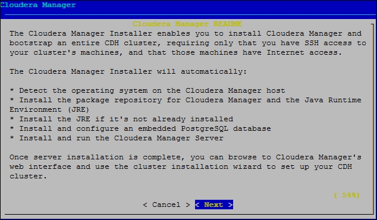

Read the Cloudera Manager License and then press **Enter** to choose **Next**. Use the arrow keys and press Enter to choose Yes to confirm you accept the license.

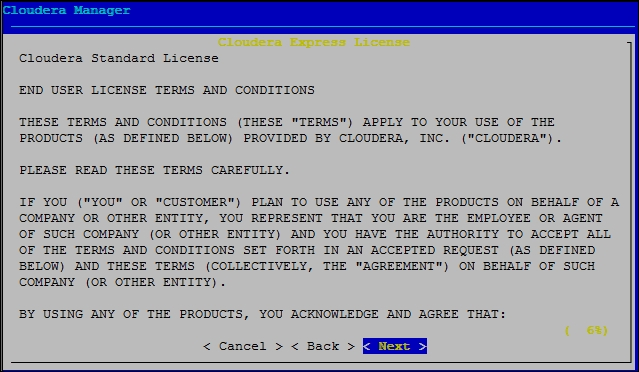

Read the Oracle Binary Code License Agreement and then press **Enter** to choose **Next**. Use the arrow keys and press Enter to choose Yes to confirm you accept the Oracle Binary Code License Agreement. 

The Cloudera Manager installer begins installing the Oracle JDK and the Cloudera Manager repo files and then installs the packages. The installer also installs the Cloudera Manager Server.


Note the complete URL provided for the Cloudera Manager Admin Console, including the port number, which is **7180** by default. 

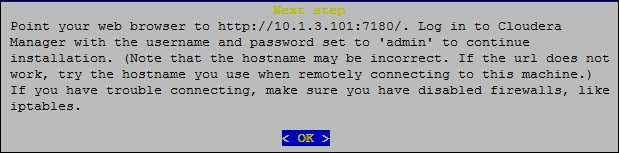

Click OK to continue. Click OK to exit the installer.

### Start the Cloudera Manager Admin Console

Once the installation is done, launch a web browser and login to the Cloudera Manager Admin Console. The Cloudera Manager Admin Console enables you to use Cloudera Manager to configure, manage, and monitor Hadoop on your cluster. 

``` ruby
http://hostname:7180/cmf/login
```
The default credentials are: **Username:** `admin` **Password:** `admin`.

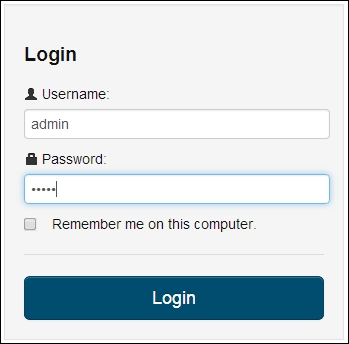

### Specify the Cloudera Manager edition
The first time you log in, you will be prompted to select the Cloudera Manager edition. We will go ahead and install the Cloudera Enterprise Data Hub Edition Trial version, which can be evaluated for 60 days. This gives us enough time to test out all the features of the full version of Cloudera Manager. If you are interested in getting the Cloudera Manager license, you will need to contact Cloudera directly.

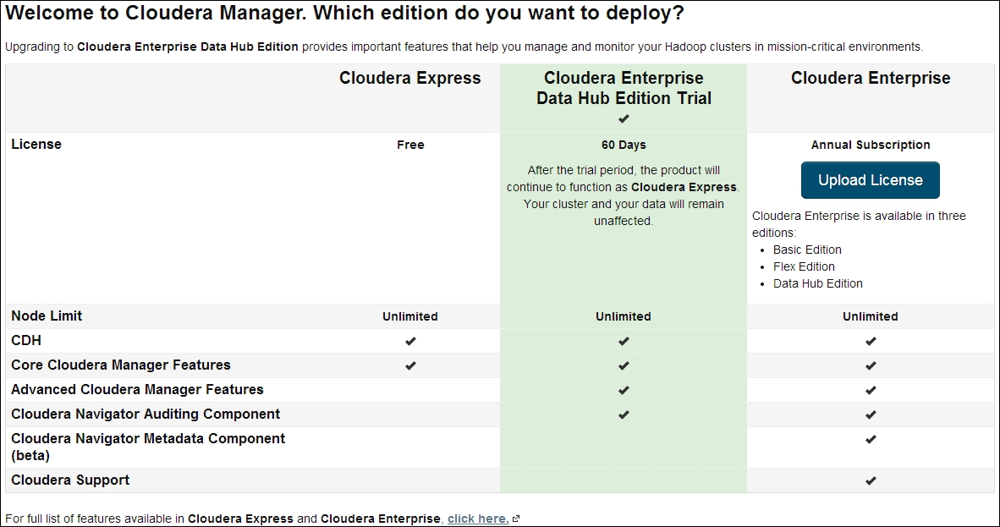

The next screen, as shown in the following screenshot, will display the list of services that will be installed as part of `Cloudera Enterprise Data Hub Edition Trial 5.2.1`. Click on Continue.

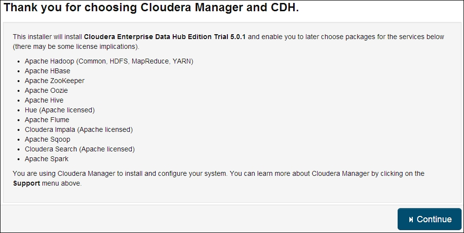

### Specify hosts for CDH cluster installation

In the next step, you will need to enter the hostnames or IP addresses of all machines that are going to be part of your Apache Hadoop cluster. As shown in the following screenshot, you can enter all the addresses and click on Search to check whether they are available:

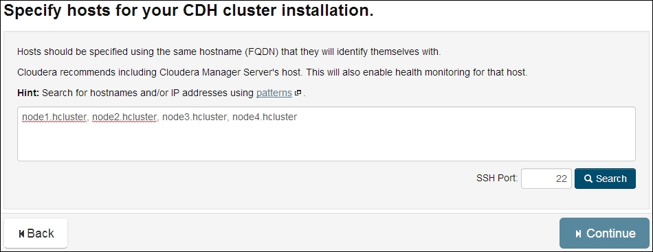

After you perform the search, all the machines will be listed as shown in the following screenshot along with the response time from each machine. Once you are satisfied with the results, select the required nodes and click on Continue.

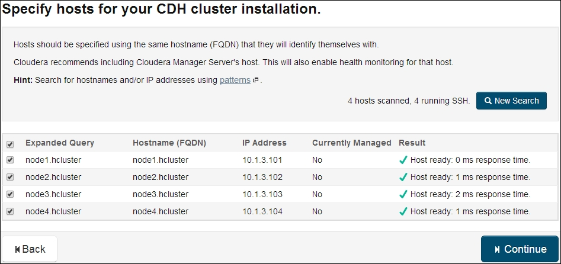

### Cluster Installation - Select Repository

After the node selection, you will be presented with a few options to perform the cluster installation as shown in the following screenshot. The cluster installation is a five-step process. The installer provides two types of installation options: packages and parcels. Cloudera recommends the use of parcels, for now we will go ahead with packages. After selecting the required options, click on Continue.

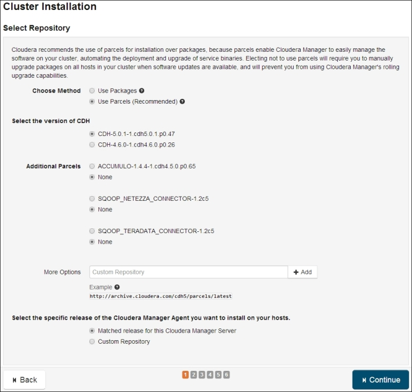

### Cluster Installation - JDK Installation Optioins

The next screen, as shown in the following screenshot, provides an option to install Java Development Toolkit and Java Unlimited Strength Encryption Policy Files. These files are used to set up a secure server. For now, we will check the JDK checkbox and leave the Encryption Policy box unchecked and click on Continue.

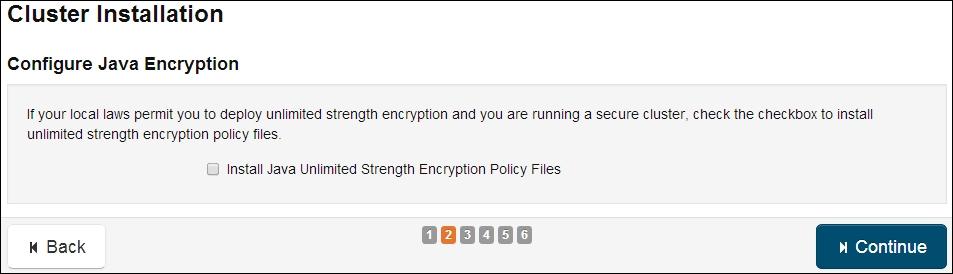

### Cluster Installation - Provide SSH Login Credentials

Next, provide the SSH username and password to log in to the different machines as shown in the following screenshot. As you can see, we are using the root user. For this set up, the root password is the same for all the nodes in the cluster. Once you are done entering the credentials, click on Continue.

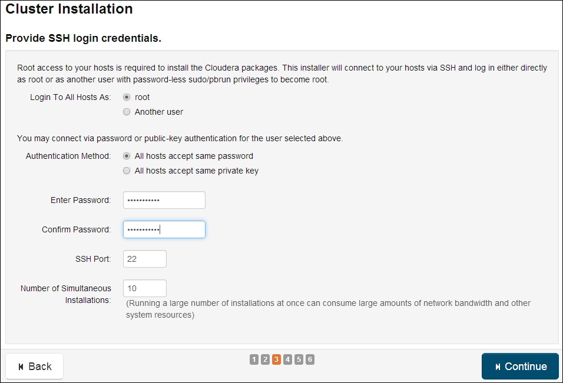

### Cluster Installation - Install all the Cloudera Manager components to all the hosts in the cluster

The next step starts installing all the Cloudera Manager components to the different machines on the cluster as shown in the following screenshot. This may take a few minutes to complete. 

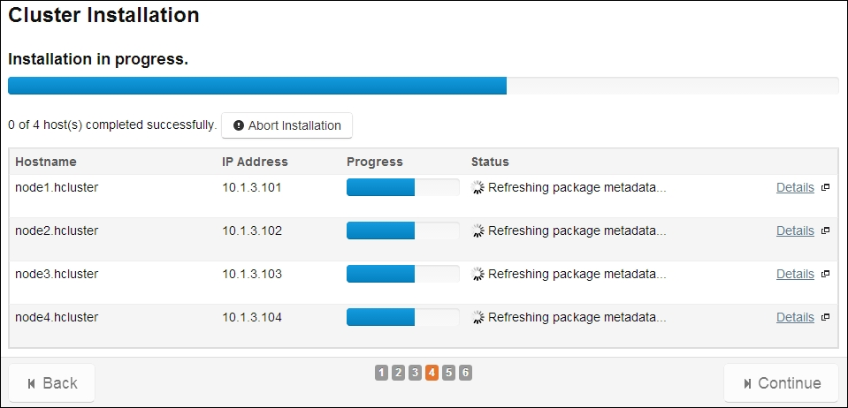

After the installation completes, you should see the output as shown in the following screenshot. This confirms that the initial set of Cloudera Manager components have been installed correctly. Also, you will notice that the previously grayed-out Continue button is now active. Click on Continue to proceed.

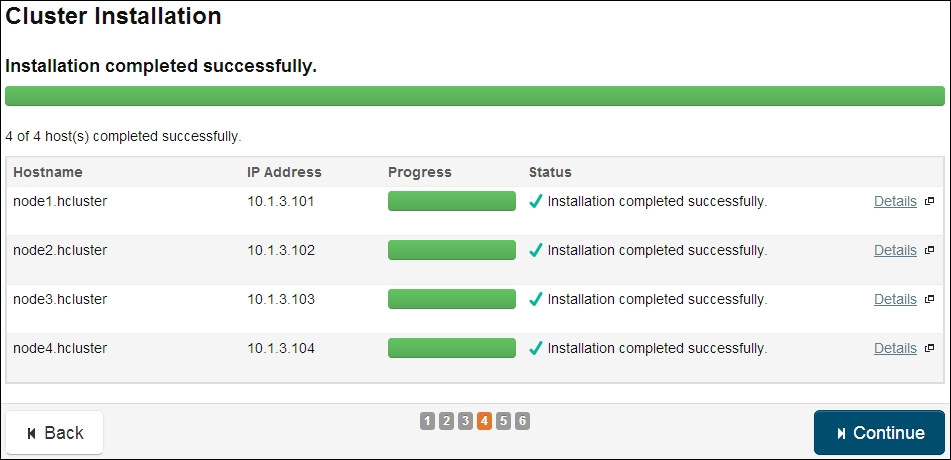

After the installation of the initial components of Cloudera Manager, the next step installs the CDH5 parcel as shown in the following screenshot. Once the installation completes, click on Continue to proceed.


After the parcel is installed, all hosts are inspected for correctness as shown in the following screenshot. If there are any errors, a cross mark is displayed next to the failed validation. Click on Continue to proceed.

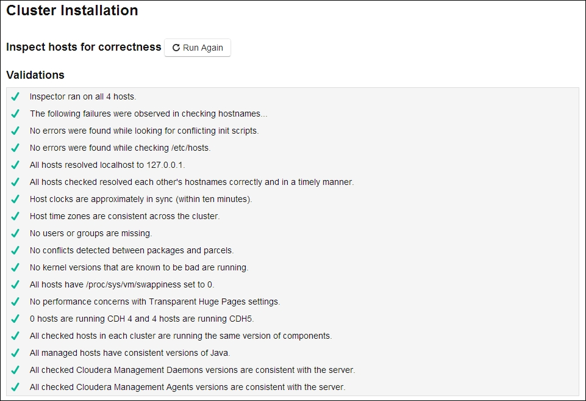

### Cluster Setup - Choose the CDH 5 Services for Installation

The next screen, as shown in the following screenshot, will prompt you to select the different combination of services that you would like to install. Select the appropriate one and click on Continue. As you can see, I have selected All Services to get all the services available within CDH5 to our cluster.

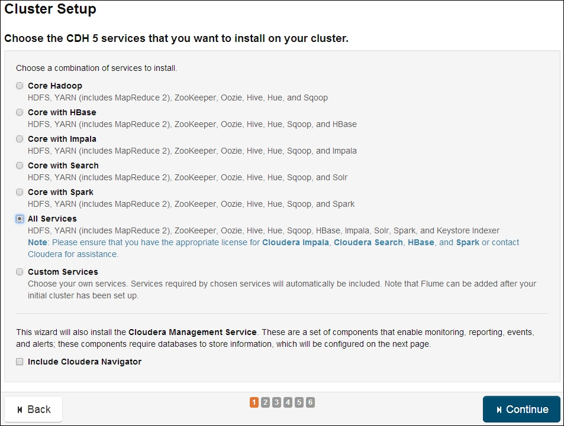

### Cluster Setup - Customise Role Assignments

The next screen provides the options that can be customized under the Customise Role Assignments option.

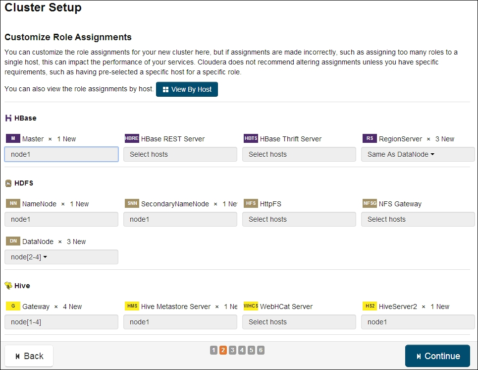

Using this screen, you can decide which services need to run on which hosts. After you are done configuring, click on Continue.

### Cluster Setup - Database Setup

The next step, as shown in the following screenshot, is to configure the database. We are selecting the Use Embedded Database option for our installation. After selecting the option, click on Test Connection to test the database connections. Once the connections are successfully tested, the Continue button will be activated. Click on Continue to proceed.

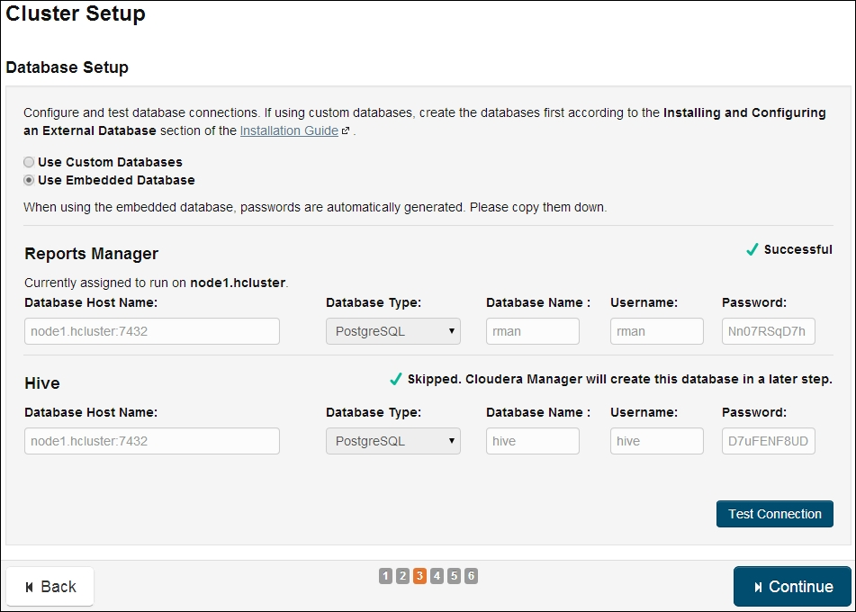

### Cluster Setup - Review Configuration

The next screen, as shown in the following screenshot, displays all the configuration values for the cluster for review. You can update the values as you desire or leave them at the defaults. Once you are done updating, click on Continue to proceed.

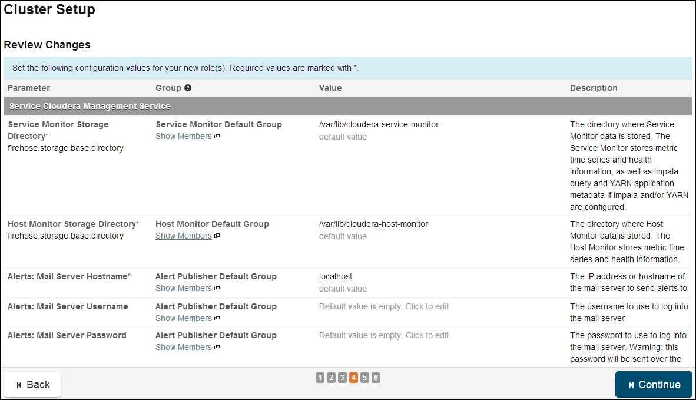

### Cluster Setup - Configure and Start all the services on the cluster

The next step, as shown in the following screenshot, starts all the services on the cluster. Once all the services have started successfully, click on Continue to proceed.

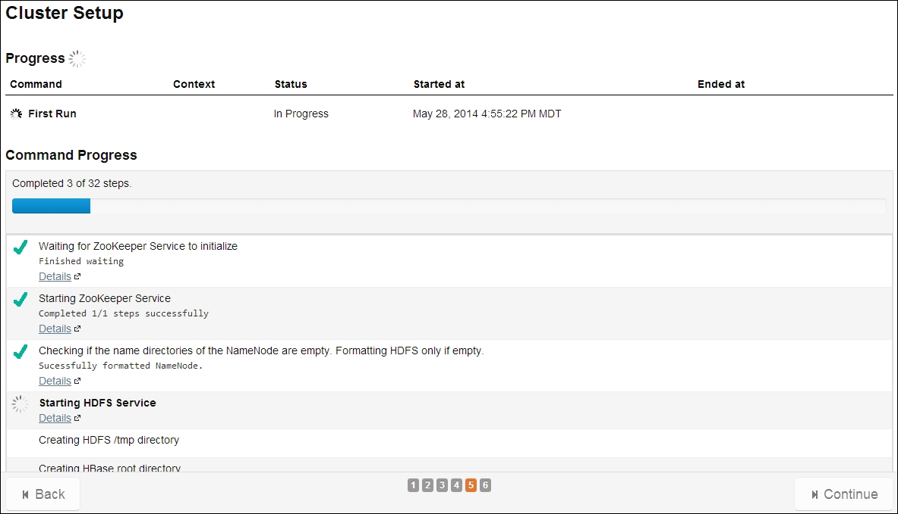

Once the installation is complete, you will be logged in to the Cloudera Manager Administrator Web console as shown in the following screenshot:

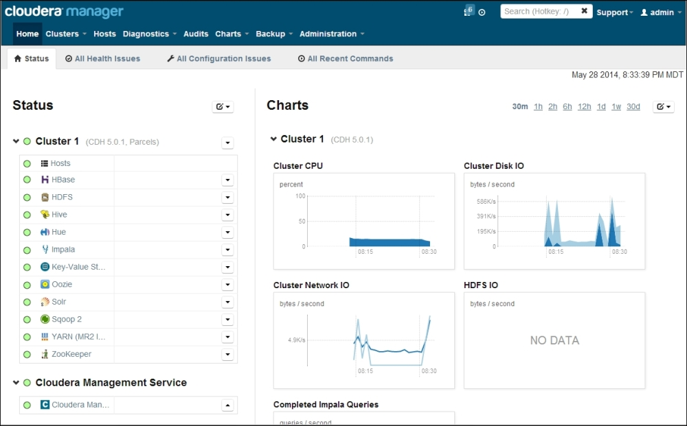

### Cluster Setup - Post-Installation Configuration Changes
Change the **administrator password**:
    * Click the gear icon images/image2.jpeg to display the Administration page.
    * Click the Users tab.
    * Click the Change Password button next to the admin account.
    * Enter a new password twice and then click Submit.

### Cluster Setup - Test the Installation
> To Do
